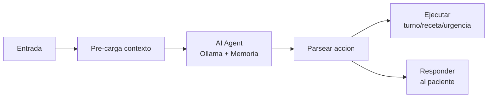

<p align="center">
  <h1 align="center">Consultorio Medico</h1>
  <p align="center">
    Sistema de gestion integral para consultorios medicos
    <br />
    Automatizacion con IA local + Dashboard Web + WhatsApp + Email
  </p>
  <p align="center">
    <strong>Stack:</strong> Next.js 14 · PostgreSQL · n8n · Ollama · Twilio · Dokploy
  </p>
</p>

<p align="center">
  <a href="#features">Features</a> ·
  <a href="#arquitectura">Arquitectura</a> ·
  <a href="#empezar">Empezar</a> ·
  <a href="#workflows">Workflows</a> ·
  <a href="#estructura">Estructura</a> ·
  <a href="#documentacion">Documentacion</a>
</p>

---

## 🏥 ¿Que hace?

Un sistema que **automatiza la comunicacion** entre pacientes y un consultorio medico usando **IA local** (Ollama + Mistral), manteniendo todos los datos en tu propia infraestructura.

**Ejemplos de lo que hace solo:**

1. Un paciente escribe por WhatsApp: _"Hola, necesito turno para el martes a la manana"_
2. La IA clasifica la intencion, busca disponibilidad, agenda el turno y confirma
3. 24h antes envia un recordatorio automatico y pide confirmacion
4. Si el paciente no confirma, alerta al medico

Todo sin intervencion humana, todo en tu VPS, todo en espanol argentino.

---

## 🎯 Features

### 🤖 Automatizacion Inteligente

| Feature | Descripcion |
|---------|-------------|
| **WhatsApp AI Agent** | Atiende mensajes, clasifica intenciones, responde y ejecuta acciones (turnos, recetas) |
| **Correo Inteligente** | Clasifica emails entrantes (urgente/spam/responder) y redacta borradores |
| **Recordatorios** | Envia recordatorios 24h y 1h antes del turno con confirmacion |
| **Resumen Diario** | Envia al medico un resumen cada manana con turnos, novedades y pendientes |
| **Recetas** | Renovacion automatica o derivacion al medico segun el caso |

### 🗄️ Datos

- Datos **100% locales** en tu VPS (nada en la nube de terceros)
- PostgreSQL con 16 tablas, 5 vistas optimizadas, 30+ indices
- Soft delete, auditoria, logs de IA y Twilio

### 📊 Dashboard Web

- Panel con KPIs en tiempo real
- Gestion de turnos (vista lista + calendario FullCalendar)
- Fichas de pacientes con historial clinico
- Bandeja unificada de conversaciones (WhatsApp + Email)
- Recetas, reportes con graficos, configuracion completa
- Modo oscuro/claro, responsive, autenticacion segura

### 🔐 Seguridad

- IA local (Ollama) - nada sale de tu VPS
- Contrasenas hasheadas con bcrypt
- Sesiones JWT con expiracion
- Consentimiento explicito para WhatsApp/Email
- Logs de auditoria de todas las acciones

---

## 🏗️ Arquitectura

```
                         PACIENTES
                     ┌─────┴──────┐
                     │            │
                  WhatsApp      Email
                     │            │
                  Twilio        IMAP
                     │            │
                ┌────▼────────────▼────┐
                │   n8n (6 Workflows)  │
                │  ┌────────────────┐  │
                │  │  AI Agents     │  │
                │  │  (Ollama +     │  │
                │  │   Memoria)     │  │
                │  └────────────────┘  │
                └────┬────────────┬────┘
                     │            │
               ┌─────▼────┐ ┌────▼──────┐
               │ Ollama   │ │PostgreSQL │
               │ (Mistral)│ │ (16 tabs) │
               └──────────┘ └────┬──────┘
                                 │
                     ┌───────────▼───────────┐
                     │  Dashboard Web        │
                     │  (Next.js 14 +        │
                     │   shadcn/ui)          │
                     └───────────────────────┘
```

[Ver documentacion completa de arquitectura →](docs/architecture.md)

---

## 🚀 Empezar

### Desarrollo Local (2 minutos)

```bash
git clone https://github.com/tu-usuario/consultorio-medico.git
cd consultorio-medico/dashboard
npm install
npm run dev
```

Abrir `http://localhost:3000` — **sin PostgreSQL, sin Ollama, sin Twilio**. Usa datos mock automaticamente.

**Credenciales de prueba:** `admin@consultorio.com` / `admin123`

### Produccion (VPS + Dokploy)

```bash
# 1. Clonar
git clone https://github.com/tu-usuario/consultorio-medico.git
cd consultorio-medico

# 2. Base de datos
createdb consultorio_medico
for f in database/migrations/0*.sql; do
  psql -U postgres -d consultorio_medico -f "$f"
done

# 3. Dashboard
cd dashboard && npm install && npm run build

# 4. n8n → Importar workflows de n8n-workflows/current/
# 5. Ollama → docker exec -it ollama ollama pull mistral
# 6. Twilio → Configurar webhook
```

[Guia de inicio rapido completa →](INSTALL.md)

---

## 🔄 Workflows

| # | Workflow | Trigger | Que hace |
|---|----------|---------|----------|
| 01 | **AI Agent WhatsApp** | Webhook Twilio | Atiende mensajes, clasifica con IA, responde, agenda turnos, recetas |
| 02 | **Gestion de Turnos** | Webhook | Crea turnos, verifica disponibilidad, Google Calendar |
| 03 | **Recordatorios** | Cron (cada hora) | Envia recordatorios 24h y 1h antes + pide confirmacion |
| 04 | **AI Agent Correo** | IMAP | Clasifica emails con IA, notifica urgencias, redacta borradores |
| 05 | **Resumen Diario** | Cron (7 AM) | Envia resumen de turnos, pacientes nuevos y pendientes |
| 06 | **Recetas** | Webhook | Renovacion automatica o deriva al medico |

[Documentacion detallada de workflows →](docs/workflows.md)

### AI Agents — El Corazon Inteligente

Los workflows 01 y 04 usan **AI Agents** de n8n con Ollama:



- **Pre-cargan datos** del paciente (turnos, recetas) antes de llamar a la IA
- **Memoria conversacional** por paciente (Postgres Chat Memory)
- **Acciones estructuradas** via `###ACCION###/###FIN###` en la respuesta del agente

---

## 📁 Estructura del Repositorio

```
consultorio-medico/
│
├── README.md                    # Esta pagina
├── INSTALL.md                   # Guia de inicio rapido
├── CHANGELOG.md                 # Historial de cambios
│
├── dashboard/                   # Aplicacion web (Next.js 14)
│   ├── app/                     # App Router
│   │   ├── dashboard/           # Paginas protegidas
│   │   │   ├── page.tsx         # KPIs principal
│   │   │   ├── turnos/          # Gestion de turnos
│   │   │   ├── pacientes/       # Fichas de pacientes
│   │   │   ├── conversaciones/  # Bandeja de chats
│   │   │   ├── recetas/         # Recetas medicas
│   │   │   ├── reportes/        # Metricas y graficos
│   │   │   └── configuracion/   # Integraciones, equipo
│   │   └── api/                 # API Routes
│   ├── components/              # Componentes React
│   │   ├── ui/                  # shadcn/ui (Radix)
│   │   ├── layout/              # Sidebar, Header
│   │   ├── calendar/            # FullCalendar
│   │   └── modals/              # Modales CRUD
│   ├── lib/                     # Logica compartida
│   │   ├── data-store.ts        # Almacenamiento dual (PG/JSON)
│   │   ├── db.ts                # Conexion Drizzle
│   │   └── auth.ts              # NextAuth config
│   ├── drizzle/                 # Schema ORM
│   └── .env.example             # Variables de entorno
│
├── database/                    # Base de datos
│   └── migrations/              # Migraciones SQL
│       ├── 001_core.sql
│       ├── 002_turnos.sql
│       ├── 003_conversaciones.sql
│       ├── 004_historial_recetas.sql
│       ├── 005_logs.sql
│       └── 006_indices.sql      # Indices + vistas
│
├── n8n-workflows/               # Automatizaciones
│   ├── current/                 # Workflows activos
│   │   ├── workflow-01-agent.json
│   │   ├── workflow-02-gestion-turnos.json
│   │   ├── workflow-03-recordatorios.json
│   │   ├── workflow-04-agent.json
│   │   ├── workflow-05-resumen-diario.json
│   │   └── workflow-06-recetas.json
│   └── archive/                 # Versiones anteriores
│       ├── workflow-01-whatsapp-inbound.json
│       ├── workflow-04-correo-inteligente.json
│       └── designs/
│
└── docs/                        # Documentacion
    ├── architecture.md           # Arquitectura del sistema
    ├── workflows.md              # Workflows detallados
    └── database.md               # Esquema de base de datos
```

---

## 🗄️ Base de Datos

**16 tablas** organizadas en 6 migraciones acumulativas:

| Migracion | Tablas |
|-----------|--------|
| 001 Core | `usuarios`, `medicos`, `pacientes`, `paciente_eventos` |
| 002 Turnos | `turnos`, `servicios`, `bloqueos_agenda` |
| 003 Conversaciones | `conversaciones`, `mensajes`, `plantillas_whatsapp`, `tareas_pendientes` |
| 004 Historial | `historial_medico`, `recetas`, `facturacion` |
| 005 Logs | `workflow_logs`, `workflow_errors`, `twilio_logs`, `ia_logs`, `audit_log` |
| 006 Indices | 30+ indices, 4 vistas optimizadas |

[Documentacion completa de la base de datos →](docs/database.md)

---

## 🧠 IA Local (Ollama + Mistral)

Todo el procesamiento de lenguaje natural corre **localmente en la VPS**:

- **Clasificacion de intenciones**: saludo, turno, receta, urgencia, consulta...
- **Extraccion de entidades**: fechas, medicamentos, sintomas...
- **Generacion de respuestas**: en espanol argentino, tono profesional y cercano
- **Triaje de urgencias**: deteccion de palabras clave y contexto
- **Memoria conversacional**: el agente recuerda la conversacion anterior

No se envia ningun dato a OpenAI, Google o cualquier servicio externo.

---

## 📚 Documentacion

| Documento | Descripcion |
|-----------|-------------|
| [INSTALL.md](INSTALL.md) | Guia de inicio rapido |
| [docs/architecture.md](docs/architecture.md) | Arquitectura del sistema |
| [docs/workflows.md](docs/workflows.md) | Workflows en detalle |
| [docs/database.md](docs/database.md) | Esquema de base de datos |
| [CHANGELOG.md](CHANGELOG.md) | Historial de cambios |

---

## 🛠️ Stack

| Capa | Tecnologia |
|------|-----------|
| Frontend | Next.js 14, shadcn/ui, Radix UI, Tailwind CSS |
| Calendario | FullCalendar 6 |
| Graficos | Recharts |
| ORM | Drizzle ORM |
| Base de Datos | PostgreSQL |
| Automatizacion | n8n (self-hosted) |
| IA Local | Ollama + Mistral |
| Mensajeria | Twilio (WhatsApp, SMS) |
| Autenticacion | NextAuth v5 + bcrypt |
| Despliegue | Dokploy (VPS) |
| Paquete | pnpm |

---

<p align="center">
  Hecho con ❤️ por <a href="https://aicorebots.com">Aicore</a>
  <br />
  Automatizaciones · Agentes de IA · Chatbots
</p>
