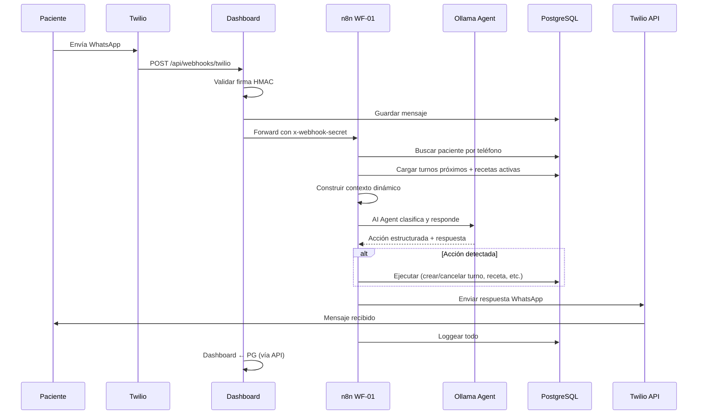
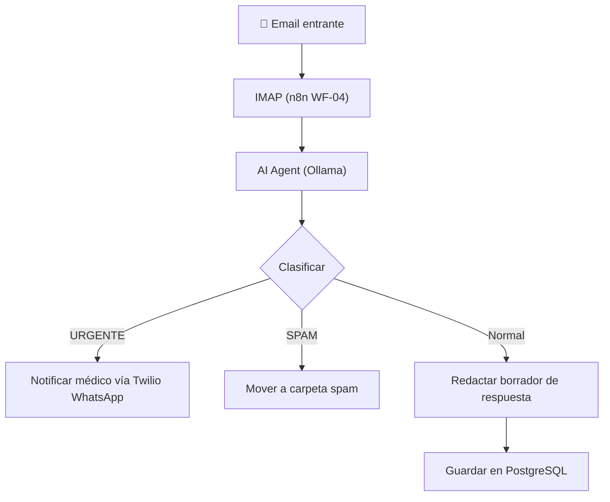
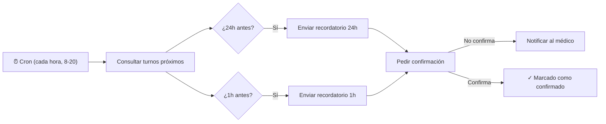
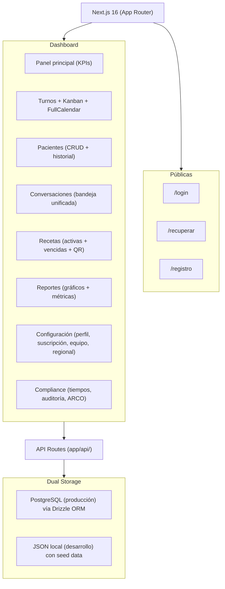
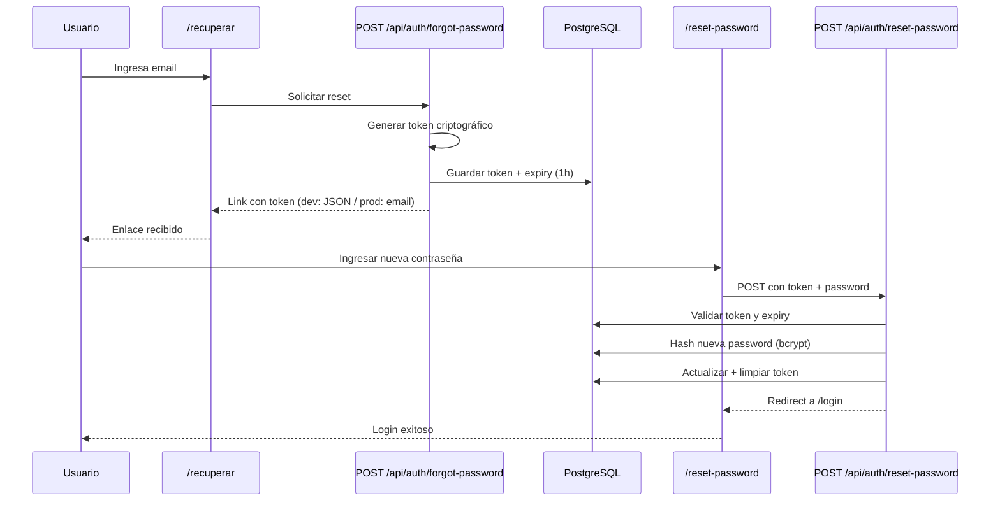
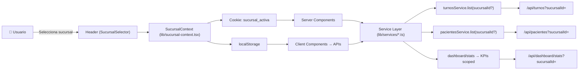
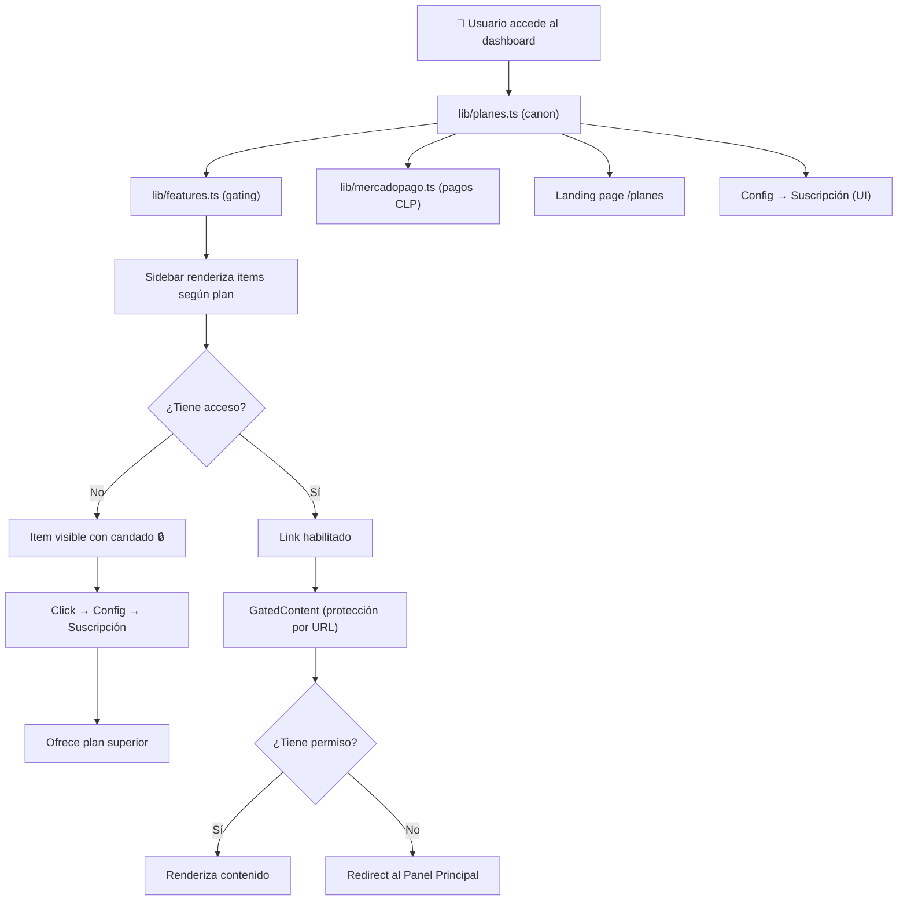

# 🏗️ Arquitectura del Sistema

## Visión General

El sistema integra cinco capas principales que trabajan juntas para automatizar la comunicación y gestión de un consultorio médico:

```mermaid
graph TD
    USUARIOS["👥 Usuarios (Pacientes)"]
    USUARIOS -->|WhatsApp / Twilio / Email / Web| SEG["🔒 Seguridad (Middleware)"]

    subgraph SEG [Capa de Seguridad]
        H1[Headers HTTP]
        H2[Rate Limiting]
        H3[2FA / MFA]
        H4[Cookie Verify]
        H5[Twilio Signature]
        H6[Auditoría Accesos]
        H7[Password Lockout]
        H8[Tokens]
    end

    SEG --> N8N["⚙️ n8n (Automatización)"]

    subgraph N8N [n8n Workflows]
        WF1[WF-01: AI Agent WhatsApp]
        WF2[WF-02: Gestión Turnos]
        WF3[WF-03: Recordatorios]
        WF4[WF-04: Correo Inteligente]
        WF5[WF-05: Resumen Diario]
        WF6[WF-06: Recetas]
        WF12[WF-12: Scoring No-Show]
    end

    N8N --> OLLAMA["🧠 IA Local (Ollama + Gemma3)"]

    subgraph OLLAMA [Ollama]
        CLASIF[Clasificación de intenciones]
        GENERA[Generación de respuestas]
        EXTRAE[Extracción de entidades]
        TRIAJE[Triaje de urgencias]
        MEMORIA[Memoria conversacional]
    end

    OLLAMA --> PG["🗄️ PostgreSQL"]

    subgraph PG [Base de Datos]
        T1[pacientes]
        T2[turnos]
        T3[conversaciones]
        T4[mensajes]
        T5[médicos]
        T6[recetas]
        T7[historial]
        T8[logs]
        T9[usuarios]
        T10[suscripciones]
        T11[credenciales]
        T12[auditoría]
        T13[risk_score]
    end

    PG --> DASH["📊 Dashboard Web (Next.js 16 + shadcn/ui)"]
    PG --> MB["📈 Metabase (Analytics)"]

    subgraph DASH [Dashboard]
        D1[KPIs]
        D2[Turnos]
        D3[Pacientes]
        D4[Conversaciones]
        D5[Recetas]
        D6[Reportes]
        D7[Configuración]
        D8[Admin]
        D9[Compliance]
    end

    subgraph MB [Metabase]
        M1[Dashboards personalizados]
        M2[Reportes SQL]
        M3[Sincronización horaria]
    end
```



## Flujo de Datos

### 1. Mensaje de WhatsApp entrante



### 2. Correo electrónico entrante



### 3. Recordatorios automáticos



### 4. Dashboard Web



### 5. Recuperación de Contraseña



### 6. Multi-Sucursal Scoping



### 7. Feature Gating por Plan



## Stack Tecnológico

| Capa | Tecnología | Versión |
|------|-----------|---------|
| **Frontend** | Next.js (App Router) | 14.2+ |
| **UI** | shadcn/ui + Radix UI + Tailwind CSS | - |
| **Calendario** | FullCalendar | 6.1+ |
| **Gráficos** | Recharts | 2.12+ |
| **ORM** | Drizzle ORM | 0.31+ |
| **Base de Datos** | PostgreSQL | 15+ |
| **Automatización** | n8n (self-hosted) | Última |
| **IA Local** | Ollama + Gemma3 | - |
| **Analítica** | Metabase (self-hosted) | 0.52.x |
| **Mensajería** | Twilio (WhatsApp, SMS) | - |
| **Autenticación** | NextAuth v5 + bcrypt | - |
| **Pagos** | MercadoPago SDK | 2.12+ |
| **Despliegue** | Dokploy (VPS) | - |

## Decisiones de Arquitectura

### ¿Por qué AI Agents en lugar de múltiples llamadas HTTP a Ollama?

Los workflows originales usaban nodos HTTP Request para llamar a Ollama, lo que implicaba:
- 2-3 llamadas separadas por workflow (clasificar, responder, extraer)
- Sin memoria entre llamadas
- Parseo manual de respuestas JSON

Con AI Agents (`@n8n/n8n-nodes-langchain.agent`):
- **Una sola ejecución** del agente que clasifica, razona y genera respuesta
- **Memoria conversacional** nativa (Postgres Chat Memory)
- **System prompt dinámico** con datos reales del paciente
- **Estructura de salida** controlada via instrucciones en el prompt

### ¿Por qué pre-carga de datos en vez de toolCode/toolWorkflow?

El nodo `code` de n8n corre en un sandbox que no tiene acceso directo a PostgreSQL. En lugar de usar `toolCode` o `toolWorkflow` (que añaden complejidad y latencia), los AI Agents reciben **todo el contexto necesario pre-cargado** en el prompt:

```
En vez de:  Agente → toolCode → query DB
Hacemos:    PG query → Code (genera prompt con datos) → Agente
```

### ¿Por qué almacenamiento dual (PostgreSQL + JSON)?

Para desarrollo local sin necesidad de PostgreSQL:
- **Producción**: PostgreSQL vía Drizzle ORM
- **Desarrollo**: Archivos JSON en `.data/` con seed data automática
- La detección es automática: si PostgreSQL no responde, cae a JSON

### ¿Por qué feature gating con single source of truth?

Los planes de suscripción están centralizados en `lib/planes.ts`:

```
lib/planes.ts (canon) ─┬→ lib/features.ts (gating)
                       ├→ lib/mercadopago.ts (pagos en CLP)
                       ├→ landing page / planes
                       └→ Config → Suscripción (UI)
```

Ventajas:
- Cambiar un precio en un solo archivo actualiza todo el sistema
- Los features requeridos por plan están tipados y centralizados
- El sidebar, las rutas y los tabs se bloquean consistentemente

### ¿Por qué token de recuperación en tabla usuarios?

En lugar de una tabla separada, se agregaron columnas `reset_token` y `reset_token_expires` directamente en `usuarios`:
- Una consulta menos (no hay JOIN)
- El token se limpia automáticamente al usarlo
- Expira a la hora por seguridad

## Seguridad

- Datos **100% locales** en VPS propia (nada pasa por nubes externas)
- Contraseñas hasheadas con bcrypt
- Sesiones JWT con expiración (30 min, renovables)
- 2FA / MFA con TOTP
- Rate limiting: 5 intentos/min login, 30/min API
- Bloqueo de cuenta tras 5 intentos fallidos
- Auto-logout por inactividad
- Password validator (8+ chars, mayúscula, número, símbolo)
- Soft delete en todas las tablas (nada se borra físicamente)
- Logs de auditoría de todas las acciones (multi-tenant con tenantId)
- Logout tracking via events.signOut()
- Cleanup de auditoría (API DELETE con antigüedad o total)
- Verificación de firmas Twilio (HMAC-SHA256) y MercadoPago
- HMAC timingSafeEqual en webhooks n8n
- Sanitización de prompts IA anti-jailbreak
- Consentimiento explícito para comunicación por WhatsApp/email
- CSP centralizado en proxy + COOP/COEP/CORP
- Docker secrets en producción (credenciales no en .env)
- Mínimo privilegio PostgreSQL (REVOKE CREATE post-migración)
- Variables de entorno para todas las credenciales
- Tokens de recuperación con expiración (1 hora) y un solo uso
